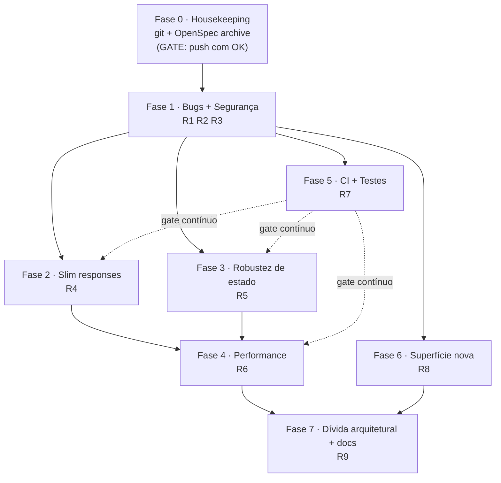
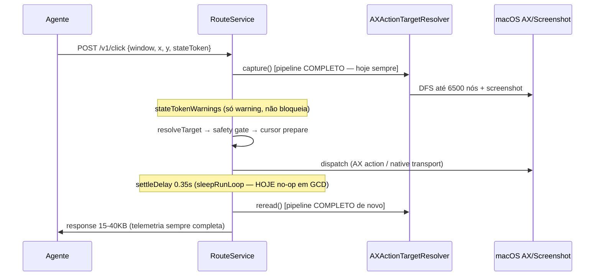

# feat: BCU hardening & agent-DX roadmap

> **Andaime, não contrato.** Este plano é o insumo. O contrato canônico são as changes OpenSpec autoradas a partir dele (uma por fase), cada uma validada com `openspec validate <id> --strict` e delegada a worker por fase.
>
> **Paths repo-relative.** Target repo: `background-computer-use`. Todos os paths abaixo são relativos à raiz do repo.

---

## Summary

Roadmap de endurecimento do BCU derivado de uma auditoria de 7 dimensões (71 findings, 35 confirmados por verificação adversarial). Sequencia o trabalho em 8 fases ordenadas por (valor ao agente-cliente ÷ risco): housekeeping git/OpenSpec → bugs confirmados + segurança → respostas enxutas → robustez de estado → performance de captura → CI+testes → superfície nova → dívida arquitetural. Cada fase vira uma change OpenSpec. O núcleo do BCU já é maduro (contratos self-documented, verificação de efeito honesta, auth loopback sólida); o plano ataca o que a auditoria provou estar quebrado ou caro, não reescreve o que funciona.

---

## Problem Frame

O BCU é a ferramenta canônica de validação visual de apps desktop macOS do orquestrador. A auditoria (workflow `bcu-audit`, 47 subagentes, 2 rodadas de verificação adversarial) mapeou o estado real do código em `main` (13 commits ahead do origin, working tree sujo com 2 features prontas não commitadas):

- **O núcleo é bom.** Self-doc rica em `/v1/routes`, strict decoding que nomeia campos, classificação honesta (`success`/`effect_not_verified`/`verifier_ambiguous`), lanes serializadas por janela, auth loopback com token de 256 bits. Isso não se toca.
- **Mas há bugs confirmados que enganam o agente-cliente.** A self-doc mente sobre defaults (`includeMenuBar`), `sleepRunLoop` é no-op em threads GCD (settle delays e poll do `wait_for` viram zero), `wait_for gone=true` retorna 404 no exato momento em que a espera deu certo, `internal_error` engole a causa real, `scoreWindow` duplicado e divergente faz `press_key` resolver janela diferente de `click`.
- **E o custo de contexto é alto.** Cada ação devolve 15-40KB (telemetria sempre completa, árvore AX em representação tripla, JSON pretty-printed); toda ação paga 2-4 pipelines AX completos (o `stateToken` que existe pra identificar estado nunca é usado como cache); a captura recaptura tudo mesmo com `scopeTarget`.
- **A rede de segurança é fina.** 2.4K LOC de teste vs 33.7K de fonte (~7%), sem CI algum, e o coração puro-testável (`AXProjectedTreeBuilder`, 2.101 LOC, de onde saem os `displayIndex` de TODA ação) tem zero testes; ~42% do LOC de teste é cosmética de cursor.

O objetivo: transformar os findings verificados num roadmap executável que fecha os buracos sem regredir o núcleo, priorizando o que o agente-cliente sente na pele.

---

## Requirements

Rastreabilidade: cada R-ID abaixo mapeia a um cluster de findings verificados da auditoria. Severidade herda o pior finding do cluster.

- **R1 — Correção de contrato/self-doc.** O que `/v1/routes` documenta deve bater com o que o código faz (defaults, spaces de coordenada, campos vivos vs mortos). *(findings: includeMenuBar invertido, drag/resize space, verificationMode morto, imageMode que captura e joga fora, chord sem descrição, session header não documentado)*
- **R2 — Correção de runtime.** Ações e esperas devem se comportar como anunciado sob condições reais. *(sleepRunLoop no-op, wait_for gone=true 404, SessionLimiter sem refcount, scoreWindow divergente, internal_error engole causa)*
- **R3 — Segurança proporcional.** Fechar os vetores reais de single-user local sem teatro. *(constant-time token, permissões 0600, redaction de debug-artifacts, Host guard, default auth obrigatório)*
- **R4 — Custo de contexto controlável.** O agente deve poder pedir só o que precisa. *(verbosity slim, treeMode, remover pretty-print, /v1/routes filtrável)*
- **R5 — Robustez de estado observável.** O agente não deve receber estado stale/congelado como atual sem aviso. *(stateToken sem pixel/tempo, oclusão não detectada, stale stateToken só warning, click verification fraca)*
- **R6 — Performance de captura.** Reduzir o custo por chamada sem perder correção. *(cache por stateToken, scopeTarget real, WaitFor fast-path, gate por role, windowing denso, hash streaming, compositor)*
- **R7 — Rede de regressão.** CI + testes do núcleo puro-testável. *(CI ausente, top-5 targets sem teste, HTTP parser, smoke solto)*
- **R8 — Superfície pro agente.** Fechar os gaps de capability que forçam o agente a workarounds caros. *(find_elements, hover, app lifecycle, list_displays, x/y no scroll, features[], batch)*
- **R9 — Dívida arquitetural + docs.** Reduzir a superfície de manutenção e o drift doc↔código. *(router por tabela, dedupe de helpers, extração de god files, rename, docs de coordenadas)*

---

## Key Technical Decisions

- **KTD-1 — Uma change OpenSpec por fase, não por finding.** As 8 fases mapeiam 1:1 a changes. Findings relacionados agrupam num Implementation Unit coeso (atomic commit). Motivo: o repo já usa OpenSpec como gate; granularidade por finding produziria 71 changes ingerenciáveis.
- **KTD-2 — Ordem = valor-ao-agente ÷ risco, com housekeeping primeiro.** Fase 0 (git/archive) é pré-requisito duro: há trabalho load-bearing não commitado; soltar worker sobre working tree sujo arrisca perder feature pronta (circuit-breaker de checkpoint). Bugs/segurança (Fase 1) vêm antes de features (Fase 6) porque corrigem enganos que o agente já sofre hoje.
- **KTD-3 — Extração cirúrgica, nunca reescrita, nos god files.** `ScrollRouteService` (2434 LOC) e `ClickRouteService` (1900) não se reescrevem; extrai-se o diff de imagem pra `Screenshot/` e a verificação compartilhada pra `Actions/Shared/`, mantendo o fluxo intacto. Só isso corta ~800 LOC do Scroll.
- **KTD-4 — Sem abstração de registro dinâmico de rotas.** O `switch` explícito no Router + enum no RouteRegistry é o padrão intencional (self-documenting via `/v1/routes`). O "router por tabela" (U-fase7) deriva o *dispatch* dos descriptors pra matar a duplicação path-literal, mas mantém o enum e os descriptors — não introduz registro mágico. (ponytail: a duplicação é o problema, não a explicitude.)
- **KTD-5 — Slim por opt-in, default preserva compat.** `verbosity`/`treeMode` são campos novos opcionais com default = comportamento atual. Nenhuma resposta muda de forma sem o agente pedir. Remover `.prettyPrinted` é a única mudança global (mantém `.sortedKeys` pra diffs estáveis).
- **KTD-6 — Cache por stateToken é memo de captura, não store persistente.** LRU de 1-2 entradas por windowID guardando `envelope + liveElementsByCanonicalIndex + stateToken`, invalidado no `windowWrite`. Fallback pra recaptura se o dispatch AX falhar (elemento morto). Não é cache de resposta HTTP.
- **KTD-7 — Testes por fixture, sem refactor de DI pesado.** O top-5 puro-testável (`AXProjectedTreeBuilder`, classificadores, `StateToken`, `ScreenshotCoordinateContract`, `AXActionTargetResolver`) opera sobre DTOs `Codable` — testável com fixtures JSON sem janela real nem DI framework. O único seam opcional é `Router.init(services:)` pra testar dispatch feliz.
- **KTD-8 — `sleepRunLoop` vira thread-aware, não substituição cega.** A auditoria achou call sites que DEPENDEM de `RunLoop.run` (bombeamento de AXObserver em `WindowMotionBackend`, branches main-thread do `CursorCoordinator`). O fix é `Thread.isMainThread || tem source anexado ? run(until:) : Thread.sleep`, não troca global.
- **KTD-9 — Nonce/replay no auth fica FORA.** Loopback single-user: quem lê o manifest já tem o token; não há rede no meio. Constant-time entra (custo trivial), nonce não (teatro). Decisão do gate de escopo, confirmada pelo usuário.

---

## High-Level Technical Design

### Sequenciamento das fases (dependências)

Fase 5 (CI) idealmente vem logo após a Fase 1 pra virar gate das demais. Fase 7 vem por último: é a mais cara e menos urgente, e se beneficia de todas as extrações já mapeadas pelas fases anteriores.

### Fluxo read-act-read (contexto pra Fases 1/3/4)

Fase 4 insere o memo por `stateToken` entre `capture()` e o pipeline; Fase 2 corta o payload da response; Fase 1 conserta o `settleDelay`; Fase 3 endurece a verificação e o `stateToken`.

---

## Scope Boundaries

### Em escopo
Todas as 9 categorias de requirement (R1–R9), incluindo a dívida arquitetural pesada (confirmado pelo usuário: "todas as melhorias pendentes").

### Deferred para follow-up (dentro das fases, não bloqueiam)
- **Rota OCR standalone** (re-OCR por região): só se surgir demanda real; a Fase 1 apenas conserta a falha silenciosa de `includeOCR + imageMode=omit`.
- **Runner self-hosted Mac pra smoke nightly** (Fase 5): curto prazo é referenciar o smoke no release checklist; o runner físico é follow-up.
- **`batch` de ações** (Fase 6): último item, só se o custo por-request provar ser gargalo real; o session header já cobre exclusão mútua.
- **Diff incremental de árvore** (Fase 4): só faz sentido depois do memo por stateToken existir.

### Fora de escopo (decisão explícita)
- **Nonce/timestamp no auth** — teatro de segurança em loopback single-user (KTD-9).
- **Reescrita dos god files** — extração cirúrgica só (KTD-3).
- **DI framework** — seam mínimo `init(services:)` basta (KTD-7).
- **Suporte não-macOS** — o runtime é loopback macOS-only; a Fase 7 só corrige o frontmatter `platforms` da skill pra refletir isso.

---

## Implementation Units

> Agrupados por fase. Cada fase = uma change OpenSpec (slug sugerido no header da fase). U-IDs estáveis. Findings citados por dimensão/título pra rastreio.

## Fase 0 — Housekeeping (change: `archive-shipped-work`)

### U1. Commit das features prontas + archive das 3 changes + baseline OpenSpec
**Goal:** Persistir o trabalho load-bearing não commitado e alinhar `openspec/specs/` com o código shipped, antes de qualquer worker tocar o tree.
**Requirements:** pré-requisito de todas (KTD-2).
**Dependencies:** nenhuma.
**Files:**
- `openspec/changes/add-annotate-window-route/` (archive), `openspec/changes/enhance-wait-for-conditions/` (archive), `openspec/changes/enhance-agent-cursor-feedback/` (archive)
- `openspec/specs/action-verification/spec.md`, `cursor-overlay/spec.md`, `request-validation/spec.md`, `window-discovery/spec.md` (preencher `## Purpose` TBD)
- `openspec/project.md` (criar — convenções do repo pra autores de spec)
- `SWIFT_PACKAGE_EXPOSURE_PLAN.md` (mover pra archive ou virar seção README)
**Approach:** As 3 changes têm tasks 100% `[x]` e código presente no tree (`add-annotate-window-route` e `enhance-wait-for-conditions` untracked; `enhance-agent-cursor-feedback` já commitada). Commitar as untracked como features coesas, depois `openspec archive <slug>` nas 3 pra promover os deltas a `specs/`. Preencher os 4 `Purpose: TBD` (1-2 frases cada). Criar `openspec/project.md` documentando: Swift 6.2 / macOS 14, zero deps, Swift Testing, os 5 pontos de wiring de rota, o ciclo read-act-read.
**Execution note:** Esta fase é do orquestrador (git/openspec), não de worker de código. **GATE: o push dos commits precisa de OK explícito do Guilherme** (git sagrado) — commit local e archive podem prosseguir; push espera.
**Test scenarios:** `Test expectation: none — housekeeping git/docs, sem mudança de comportamento. Verificação: openspec validate --strict passa nas 4 specs promovidas; git log mostra as 2 features commitadas; openspec/specs/ tem 7 capabilities (4 atuais + wait-for + visual-annotations + agent-feedback-overlay).`

---

## Fase 1 — Bugs confirmados + segurança (change: `fix-agent-api-correctness`)

### U2. `sleepRunLoop` thread-aware (settle delays + poll do wait_for realmente dormem)
**Goal:** Fazer os settle delays das ações e o poll do `wait_for` de fato pausarem, sem quebrar os call sites que dependem de bombear o runloop.
**Requirements:** R2.
**Dependencies:** U1.
**Files:** `Sources/BackgroundComputerUse/Shared/RunLoopSupport.swift`, `Sources/BackgroundComputerUse/Actions/WaitFor/WaitForRouteService.swift`, `Sources/BackgroundComputerUse/Actions/Click/ClickRouteService.swift`, `SetValue/`, `TypeText/`, `PressKey/`, `SecondaryAction/` (call sites de settleDelay), `Sources/BackgroundComputerUse/StatePipeline/.../WindowMotionBackend.swift` (preservar), `Sources/BackgroundComputerUse/Cursor/CursorCoordinator.swift` (preservar branches main-thread), `Tests/BackgroundComputerUseTests/` (novo teste)
**Approach (KTD-8):** `sleepRunLoop` = `RunLoop.current.run(until:)` retorna imediato em thread GCD sem source. Trocar por `Thread.sleep(forTimeInterval:)` **apenas** quando `!Thread.isMainThread` e sem source anexado. `WindowMotionBackend` (bombeia AXObserver via `CFRunLoopAddSource`) e os branches `Thread.isMainThread` do `CursorCoordinator` mantêm `run(until:)`. `AXMenuPathActivator` tem cópia shadow da função — alinhar.
**Test scenarios:**
- Micro-teste que mede o tempo real de `sleepRunLoop` numa `DispatchQueue` concorrente: assert `elapsed >= interval * 0.9` (hoje seria ~0).
- Verificação de que o call site do `WindowMotionBackend` continua usando `run(until:)` (grep de guarda no teste ou revisão).
- `Test expectation`: o poll do `wait_for` não vira busy-loop — medir nº de capturas num intervalo fixo com pollInterval alto.
**must_haves:**
- truths: "settle delay de ação de fato pausa antes do reread de verificação em thread GCD"; "poll do wait_for respeita o pollInterval em vez de martelar captura back-to-back".
- artifacts: `Sources/BackgroundComputerUse/Shared/RunLoopSupport.swift` (helper thread-aware).
- key_links: `grep -n "Thread.isMainThread" Sources/BackgroundComputerUse/Shared/RunLoopSupport.swift`.

### U3. Correções de contrato/self-doc (a doc deve bater com o código)
**Goal:** Eliminar toda divergência doc↔código que ensina o agente errado.
**Requirements:** R1.
**Dependencies:** U1.
**Files:** `Sources/BackgroundComputerUse/API/RouteRegistry.swift` (defaults, descriptions), `Sources/BackgroundComputerUse/API/APIDocumentation.swift` (drag/resize usage), `Sources/BackgroundComputerUse/StatePipeline/WindowStateService.swift` / `WindowAnnotationService.swift` (fonte dos defaults), `Sources/BackgroundComputerUse/Contracts/RouteRequestContracts.swift`
**Approach:** Consertar num commit os enganos de contrato confirmados: (a) `includeMenuBar` documentado invertido em `get_window_state` (doc `false`, código `?? true`) e `annotate_window` (doc `true`, código `?? false`) — corrigir os `defaultValue` no RouteRegistry e a descrição copy-paste "annotation candidate set"; idealmente derivar o default documentado da mesma constante do serviço; (b) `drag`/`resize`: usage diz "model-facing" mas o código consome AppKit-global (bottom-left) — corrigir texto pra "global screen coordinate (AppKit, bottom-left origin, logical points)" e adicionar `description` a `toX/toY`; (c) `verificationMode` (scroll) e `imageMode` (ações) — ver U4/U6, referenciar aqui pra doc; (d) `description` no campo `key` do `press_key` (sintaxe de chord: separador `+`, aliases command/cmd/meta/super, control/ctrl, option/alt, shift); (e) APIConceptDTO "session" documentando o header `X-Background-Computer-Use-Session` (409/429); (f) APIConceptDTO "coordinates" (stub — o diagrama completo é Fase 7/U-docs).
**Test scenarios:**
- `APIDocumentationTests`: para `get_window_state`/`annotate_window`, o `defaultValue` documentado de `includeMenuBar` == default efetivo do serviço.
- `Covers request-validation`: `press_key` schema tem `description` não-vazia no campo `key`.
- Assert de que a usage de `drag`/`resize` não contém a string "model-facing".
**must_haves:**
- truths: "o default de includeMenuBar em /v1/routes bate com o comportamento do serviço"; "a usage de drag/resize nomeia o coordinate space que o código realmente consome".
- key_links: `grep -n "includeMenuBar" Sources/BackgroundComputerUse/API/RouteRegistry.swift`.

### U4. Dedupe da resolução de janela divergente (`scoreWindow`/`resolveWindowElement`)
**Goal:** `press_key` resolver a MESMA janela que `click`/`scroll`/`type_text` pro mesmo `windowID`.
**Requirements:** R2.
**Dependencies:** U1.
**Files:** `Sources/BackgroundComputerUse/Actions/PressKey/PressKeyRouteService.swift` (deletar cópias), `Sources/BackgroundComputerUse/Actions/Shared/AXActionTargetResolver.swift` (expor internal), `Tests/`
**Approach:** Deletar `scoreWindow`/`resolveWindowElement` do `PressKeyRouteService` (tolerance 4, frame +100, sem bônus focused, sem fallback) e usar as do `AXActionTargetResolver` (tolerance 3, frame +80, bônus kAXFocused +10, fallback kAXFocusedWindowAttribute). As funções do resolver são `private` — promover a `internal`. Se `press_key` genuinamente precisar de pesos diferentes, isso vira decisão explícita documentada; hoje é acidente de cópia.
**Test scenarios:**
- Fixture com 2 janelas do mesmo app sem `AXWindowNumber` utilizável, uma focada: `press_key` e `click` resolvem o MESMO elemento de janela.
- `nodeID`/frame borderline: score idêntico entre as duas vias.
**must_haves:**
- truths: "press_key e click resolvem a mesma janela para o mesmo windowID em apps sem AXWindowNumber".
- artifacts: `scoreWindow`/`resolveWindowElement` existem em um único lugar (`AXActionTargetResolver`).
- key_links: `! grep -qn "func scoreWindow" Sources/BackgroundComputerUse/Actions/PressKey/PressKeyRouteService.swift`.

### U5. `wait_for gone=true` reconhece janela fechada como condição satisfeita
**Goal:** Esperar um dialog/janela sumir não deve retornar 404 no momento em que a espera dá certo.
**Requirements:** R2.
**Dependencies:** U1.
**Files:** `Sources/BackgroundComputerUse/Actions/WaitFor/WaitForRouteService.swift`, `Tests/`
**Approach:** No loop de poll (captura linha ~52) E na captura final obrigatória (linha ~80), `catch DiscoveryError.windowNotFound`: se `gone=true`, retornar `conditionMet=true` com nota "target window closed"; se `gone=false`, `conditionMet=false` com a mesma nota — nunca 404. Cobrir a race da captura final (janela fecha entre último poll e captura final).
**Test scenarios:**
- `gone=true`, janela fecha durante o poll → `conditionMet=true` + nota, não 404.
- `gone=true`, `conditionMet` já `true` no loop, janela fecha antes da captura final → ainda `true` (race coberta).
- `gone=false`, janela fecha → `conditionMet=false` + nota, não 404.
**must_haves:**
- truths: "wait_for com gone=true retorna sucesso quando a janela-alvo fecha durante a espera".
- key_links: `grep -n "windowNotFound" Sources/BackgroundComputerUse/Actions/WaitFor/WaitForRouteService.swift`.

### U6. Ações verdadeiras: SessionLimiter refcount, internal_error com causa, campos mortos, imageMode
**Goal:** Fechar os bugs de runtime/contrato restantes num commit coeso.
**Requirements:** R1, R2.
**Dependencies:** U1.
**Files:** `Sources/BackgroundComputerUse/Runtime/RuntimeSessionLimiter.swift`, `Sources/BackgroundComputerUse/API/Router.swift` (errorResponse), `Sources/BackgroundComputerUse/Actions/Scroll/ScrollRouteService.swift` + `Contracts/RouteRequestContracts.swift` (verificationMode), rotas de ação (imageMode), `Tests/`
**Approach:**
- **SessionLimiter refcount:** guardar contador por `sessionID`; `release()` decrementa e só limpa `activeSessionID` quando zerar (hoje a 1ª finalização libera a exclusão com a 2ª ação ainda em voo).
- **internal_error com causa:** no default do `errorResponse`, incluir `String(describing: error)` na message (enums já têm descrições seguras: `StatePipelineExperimentError`, `CGWindowCaptureError`, `ScreenshotCoordinateError`); mapear captura/screenshot pra códigos próprios (`capture_failed`, `screenshot_failed`) com recovery específico; usar o requestID real (hoje gera UUID novo).
- **verificationMode morto:** implementar (strict = exigir verificação em todas as reads; fast = pular rereads extras) OU remover o campo do contrato + doc + enum `ActionVerificationModeDTO` + atualizar `HardenedAgentAPITests:111`. Recomendação: remover (YAGNI até haver demanda).
- **imageMode em ações:** `click`/`press_key`/`select_text`/`perform_secondary_action` capturam screenshot e jogam fora. Escolher: expor `postScreenshot: Screenshot?` na response quando `imageMode != omit`, OU remover `imageMode` dos schemas de ação. Nas 3 rotas que documentam mas ignoram (`scroll`/`type_text`/`set_value`), remover o campo morto do schema.
**Test scenarios:**
- SessionLimiter: 2 acquires concorrentes do mesmo `sessionID`, 1 release → sessão B ainda bloqueada (refcount > 0).
- errorResponse: erro de captura conhecido → message contém a descrição do erro, não "Route X failed."
- verificationMode: se removido, `scroll` schema não lista o campo; se implementado, `strict` muda o nº de rereads.
- imageMode: `click` com `imageMode=base64` → ou `postScreenshot` presente, ou campo ausente do schema (sem captura desperdiçada).
**must_haves:**
- truths: "exclusão de sessão sobrevive a ações concorrentes da mesma sessão"; "erro interno carrega a causa real"; "nenhum campo de request documentado é silenciosamente ignorado".
- key_links: `grep -n "String(describing: error)" Sources/BackgroundComputerUse/API/Router.swift`.

### U7. Segurança proporcional (constant-time, permissões, redaction, Host guard)
**Goal:** Fechar os vetores reais de single-user local sem teatro.
**Requirements:** R3.
**Dependencies:** U1.
**Files:** `Sources/BackgroundComputerUse/API/RuntimeAuth.swift`, `Sources/BackgroundComputerUse/App/RuntimeBootstrap.swift`, `Sources/BackgroundComputerUse/Screenshot/ScreenshotCaptureService.swift`, `Sources/BackgroundComputerUse/Runtime/DebugArtifactRecorder.swift`, `Sources/BackgroundComputerUse/API/Router.swift` (Host guard), `Sources/BackgroundComputerUse/API/LoopbackServer.swift` (default auth), `Tests/`
**Approach:**
- **Constant-time token:** helper único em `RuntimeAuth` acumulando XOR sobre `[UInt8]` (`zip(a,b).reduce(0){$0 | ($1.0 ^ $1.1)} == 0 && a.count == b.count`).
- **Permissões 0600/0700:** helper de escrita compartilhado que faz `createDirectory` com `[.posixPermissions: 0o700]` e `setAttributes 0o600` após write. Aplicar em manifest (carrega token), PNGs de captura, debug-artifacts (~10 LOC total).
- **Redaction debug-artifacts:** no `record()`, redigir `text`/`value` de typeText/setValue/pressKey → `"<redacted len=N>"`, com override `DEBUG_ARTIFACTS_RAW=1`; redigir também `responseBody` de `readText`.
- **Host guard:** rejeitar request cujo `Host` não comece com `127.0.0.1`/`localhost` (mata DNS rebinding, ~4 LOC).
- **Default auth obrigatório:** remover `auth: RuntimeAuth = .disabled` dos inits de `LoopbackServer`/`Router` (testes passam `.disabled` explícito).
**Test scenarios:**
- Constant-time: teste de igualdade/desigualdade retorna correto (não é teste de timing, é de correção do helper).
- Redaction: request com `text: "senha123"` gravado → artifact contém `<redacted len=8>`, não o valor.
- Host guard: request com `Host: evil.com` → rejeitada; `Host: 127.0.0.1:PORT` → aceita.
- Permissões: manifest escrito → `posixPermissions == 0o600`.
**must_haves:**
- truths: "token comparado em tempo constante"; "manifest e PNGs escritos com 0600"; "texto digitado não vaza em claro nos debug-artifacts"; "request com Host não-loopback é rejeitada".
- key_links: `grep -rn "posixPermissions" Sources/BackgroundComputerUse/`.

### U8. Scripts da skill: manifest fallback, timeout, platforms
**Goal:** A skill deve achar o runtime mesmo sem `TMPDIR` no env e não abortar antes de `wait_for` longos.
**Requirements:** R1 (contrato da skill).
**Dependencies:** U1.
**Files:** `skills/background-computer-use/scripts/bcu-request.py`, `skills/background-computer-use/scripts/ensure-runtime.sh`, `skills/background-computer-use/SKILL.md` (frontmatter platforms)
**Approach:** Fallback de manifest: quando `TMPDIR` ausente, usar `getconf DARWIN_USER_TEMP_DIR` (shell) / `subprocess` chamando `getconf` no Python (`os.confstr('CS_DARWIN_USER_TEMP_DIR')` lança ValueError no macOS — NÃO usar). Manter `BCU_MANIFEST_PATH` como override. Timeout: aceitar `BCU_TIMEOUT` (default 30) e, pra `/v1/wait_for`, derivar de `timeoutSeconds + margem`. Frontmatter: `platforms: [macos]` (não linux/windows).
**Test scenarios:** `Test expectation: none — scripts de skill; verificação manual: rodar bcu-request.py com TMPDIR unset acha o manifest real em /var/folders/.../T/.`

---

## Fase 2 — Slim responses (change: `add-response-verbosity`)

### U9. `verbosity` nas rotas de ação
**Goal:** Deixar o agente pedir só `ok/classification/summary/tokens` sem a telemetria de 15-40KB.
**Requirements:** R4.
**Dependencies:** U1 (idealmente U6, que mexe nos mesmos contratos).
**Files:** `Sources/BackgroundComputerUse/Contracts/ClickActionContracts.swift` + Scroll/PressKey/Text/SecondaryAction contracts, `Sources/BackgroundComputerUse/API/RouteRegistry.swift`, os RouteServices, `Sources/BackgroundComputerUse/API/HTTPTypes.swift`/`Router.swift` (remover strip por nome de chave), `Tests/`
**Approach (KTD-5):** Campo `verbosity: minimal | standard | full` (default `standard` = comportamento atual). `minimal` = `ok, classification, failureDomain, summary, warnings, pre/postStateToken`; telemetria (`transports`, `routeSteps`, `planCandidates`, `verification` detalhada) só em `standard`/`full`. Substituir o strip recursivo por nome de chave (`debug:true`, que remove `notes` legítimos aninhados) por campos opcionais nos DTOs.
**Test scenarios:**
- `click` com `verbosity=minimal` → response não tem `transports`/`routeSteps`; tem `classification`/`summary`/`postStateToken`.
- `verbosity=standard` (default) → response idêntica ao comportamento atual (compat).
- `verbosity` inválido → `invalid_request` nomeando o campo (strict decoding).
**must_haves:**
- truths: "verbosity=minimal reduz a response de ação para o essencial"; "default preserva o payload atual".
- key_links: `grep -n "verbosity" Sources/BackgroundComputerUse/Contracts/ClickActionContracts.swift`.

### U10. `treeMode` + JSON compacto + `/v1/routes` filtrável
**Goal:** Cortar a árvore AX triplicada e o whitespace do payload.
**Requirements:** R4.
**Dependencies:** U1.
**Files:** `Sources/BackgroundComputerUse/StatePipeline/AXPipelineV2/Contracts/AXPipelineV2Contracts.swift`, `Sources/BackgroundComputerUse/StatePipeline/WindowStateService.swift`, `Actions/WaitFor/WaitForRouteService.swift` (state embutido), `Sources/BackgroundComputerUse/Shared/JSONSupport.swift`, `Sources/BackgroundComputerUse/API/Router.swift` (`?id=` filtro), `Tests/`
**Approach:**
- `treeMode: rendered | nodes | both | none` em `get_window_state`/`wait_for` (default `both` pra compat; docs recomendam `rendered` pra agentes — `renderedText` + `lineMappings` bastam pra escolher `display_index`). Campos raros de nó (affordances, parameterizedAttributes, transformNotes, identity) só sob flag.
- Remover `.prettyPrinted` do encoder global (`JSONSupport.swift:6`), manter `.sortedKeys`. Ajustar o re-encode do strip (`HTTPTypes.swift:229`).
- `GET /v1/routes?id=click` (e `?category=action`) filtra descriptors (3-4 linhas no case do Router).
**Test scenarios:**
- `treeMode=rendered` → `nodes[]` vazio/ausente, `renderedText` presente.
- `treeMode=both` (default) → forma atual (compat).
- Response não contém `\n  ` de indentação (pretty desligado); chaves ordenadas.
- `GET /v1/routes?id=click` → só o descriptor de click.
**must_haves:**
- truths: "treeMode=rendered elimina a representação nodes[]"; "responses não são mais pretty-printed"; "/v1/routes?id= devolve um único descriptor".
- key_links: `! grep -n "prettyPrinted" Sources/BackgroundComputerUse/Shared/JSONSupport.swift`.

---

## Fase 3 — Robustez de estado (change: `harden-state-observability`)

### U11. `stateToken` com componente de pixel + oclusão detectada
**Goal:** Agente não recebe estado congelado (Electron/janela ocluída) como atual sem aviso.
**Requirements:** R5.
**Dependencies:** U1.
**Files:** `Sources/BackgroundComputerUse/StatePipeline/StateToken.swift`, `Sources/BackgroundComputerUse/StatePipeline/AXPipelineV2/State/StatePipelineExperiment.swift` (call sites pixel=nil), `Sources/BackgroundComputerUse/Contracts/WindowStateContracts.swift` (ScreenshotDTO), `Sources/BackgroundComputerUse/Screenshot/CGWindowCaptureService.swift` + `ScreenshotCaptureService.swift` (oclusão), `Tests/`
**Approach:**
- **Pixel no token:** incluir hash barato dos pixels do screenshot no payload do token quando `imageMode != omit` (ou expor `capturedAt` + `pixelHash` separados no `ScreenshotDTO`). Documentar que `stateToken` cobre só o estado AX projetado.
- **Oclusão:** consultar `CGWindowListCopyWindowInfo` pro `windowNumber` no momento da captura (`kCGWindowIsOnscreen`, alpha); quando houver indício de oclusão/render pausado, anexar nota "window may be occluded; screenshot can be stale" no `ScreenshotDTO`.
**Test scenarios:**
- Token: mesma árvore AX + pixels diferentes → tokens diferentes (quando `imageMode != omit`).
- `ScreenshotDTO` tem `capturedAt`/`pixelHash` (ou o token embute o hash).
- Oclusão (mock de window info offscreen) → nota de staleness presente.
**must_haves:**
- truths: "stateToken distingue mudança pixel-only quando há screenshot"; "screenshot de janela ocluída carrega aviso de possível staleness".
- key_links: `grep -n "pixelHash\|capturedAt" Sources/BackgroundComputerUse/Contracts/WindowStateContracts.swift`.

### U12. Stale stateToken strict mode + click verification robusta
**Goal:** Reduzir o clique-no-elemento-errado por estado deslocado e o falso `effect_not_verified` que faz o agente re-clicar.
**Requirements:** R5.
**Dependencies:** U11 (usa o pixel diff).
**Files:** `Sources/BackgroundComputerUse/Actions/Shared/AXActionTargetResolver.swift` (stateTokenWarnings/strict), `Sources/BackgroundComputerUse/Actions/Click/ClickRouteService.swift` (rereads escalonados), `Sources/BackgroundComputerUse/Contracts/RouteRequestContracts.swift`, `Tests/`
**Approach:**
- **Strict mode:** opcional (ou automático quando `target.kind ∈ {displayIndex, nodeID}` — ambos posicionais e vulneráveis a shift; só `refetchFingerprint` é content-derived): se `suppliedStateToken != liveStateToken`, recusar com erro recuperável "state changed, re-read and re-target" em vez de prosseguir com warning.
- **Click verification:** adotar no click o esquema de rereads escalonados do scroll (80/180/320ms) em vez de uma recaptura única pós-settle; somar `sampledDifferenceRatio` (diff visual, já existe no press_key) como evidência; na resposta `effect_not_verified`, avisar explicitamente "a ação PODE ter surtido efeito não observável — não re-execute cegamente ações com side effect".
**Test scenarios:**
- Strict: `displayIndex` com `stateToken` divergente → erro recuperável, não clique.
- `nodeID` posicional com linha inserida → strict recusa (mesma classe de falha do displayIndex).
- Click: efeito sem rastro AX + diff visual positivo → `effect_verified` (não falso negativo).
- `effect_not_verified` → response contém o aviso anti-reclique.
**must_haves:**
- truths: "target posicional com stateToken divergente é recusado em strict mode"; "click usa rereads escalonados + diff visual"; "effect_not_verified avisa contra reclique cego".
- key_links: `grep -n "re-read and re-target\|do not re-execute" Sources/BackgroundComputerUse/Actions/`.

---

## Fase 4 — Performance de captura (change: `optimize-capture-cost`)

### U13. Memo de captura por windowID + stateToken
**Goal:** Parar de pagar 2-4 pipelines AX completos por ação.
**Requirements:** R6.
**Dependencies:** U11 (invalidação por estado), idealmente após Fase 5 CI.
**Files:** `Sources/BackgroundComputerUse/StatePipeline/WindowStateService.swift`, `Sources/BackgroundComputerUse/Actions/Shared/AXActionTargetResolver.swift`, `Sources/BackgroundComputerUse/Runtime/RuntimeExecutionQueue.swift` (invalidação no windowWrite), `Tests/`
**Approach (KTD-6):** Memo por `windowID` da última captura (`envelope` + `liveElementsByCanonicalIndex` + `stateToken`). Ação que chega com `stateToken` == memoizado reusa os `AXUIElement` vivos e pula o pre-capture, com fallback pra recaptura se o dispatch AX falhar (elemento morto). Invalidação: no `windowWrite` (barrier) + título/frame via resolver (já cacheado). Diff incremental de árvore é follow-up (só depois do memo).
**Test scenarios:**
- 2 ações consecutivas com mesmo `stateToken` sem write entre elas → 2ª reusa captura (contador de pipelines não incrementa).
- Ação após `windowWrite` → memo invalidado, recaptura.
- Dispatch AX falha em elemento memoizado → fallback recaptura, ação prossegue.
**must_haves:**
- truths: "ação com stateToken memoizado reusa a captura anterior"; "write invalida o memo".
- key_links: `grep -n "stateToken" Sources/BackgroundComputerUse/StatePipeline/WindowStateService.swift` (uso como chave de cache).

### U14. WaitFor fast-path + scopeTarget real + gate por role
**Goal:** Cortar o custo por-tick do `wait_for` e o custo do `scopeTarget`/captura nativa.
**Requirements:** R6.
**Dependencies:** U13.
**Files:** `Sources/BackgroundComputerUse/Actions/WaitFor/WaitForRouteService.swift`, `Sources/BackgroundComputerUse/StatePipeline/WindowStateService.swift` (scopeTarget), `Sources/BackgroundComputerUse/StatePipeline/AXPipelineV2/Capture/AXRawCaptureService.swift` (gate por role), `AXTreeScopeFilter.swift`, `Tests/`
**Approach:**
- **WaitFor fast-path:** condição title-only (`windowTitleContains`/`windowTitleChanged`) → só `resolver.resolve` por tick (zero traversal). Outras → `maxNodes` menor + `includeMenuBar=false` no poll por default. No sucesso, reusar o envelope do poll vencedor + só o screenshot (explicitar o tradeoff de skew estado↔pixel). Backoff progressivo (100→400→800ms). Nota no timeout quando `tree.truncated=true` em algum poll.
- **scopeTarget real:** quando vier com `nodeID`/refetch fingerprint, resolver o alvo primeiro e iniciar o DFS a partir dele (`roots=[alvo]`) em vez de capturar tudo e filtrar depois. Fallback pra árvore completa quando não resolve. Documentar remédio no note de truncation.
- **Gate por role na captura raw:** extração de texto só pra roles portadores de texto; actions/activationPoint só pra roles interativos (lista já existe em `AXActionabilitySupport`). Web nodes já têm esse gating — replicar pra nativos.
**Test scenarios:**
- `wait_for windowTitleContains` → nº de traversals AX == 0 (só resolve).
- `scopeTarget` com nodeID → DFS parte do alvo (nós capturados < árvore completa).
- Gate por role: `AXImage`/`AXGroup` não pagam extração de texto/actions.
**must_haves:**
- truths: "wait_for title-only não faz traversal de árvore"; "scopeTarget reduz o custo de captura, não só o payload".
- key_links: `grep -n "roots:" Sources/BackgroundComputerUse/StatePipeline/AXPipelineV2/Capture/AXRawCaptureService.swift`.

### U15. Screenshot/compositor/hash — custos fixos por chamada
**Goal:** Reduzir o overhead de CPU/alocação por captura.
**Requirements:** R6.
**Dependencies:** U1.
**Files:** `Sources/BackgroundComputerUse/Screenshot/CursorScreenshotCompositor.swift`, `Sources/BackgroundComputerUse/Screenshot/ScreenshotCaptureService.swift`, `Sources/BackgroundComputerUse/StatePipeline/StateToken.swift`, `Sources/BackgroundComputerUse/StatePipeline/AXPipelineV2/Capture/AXRawCaptureService.swift` (windowing denso O(n²)), `Sources/BackgroundComputerUse/Actions/Click/NativeBackgroundClickTransport.swift` (sleep final), `Tests/`
**Approach:** Agrupar os ganhos baratos e independentes:
- Compositor: desenhar direto em `CGContext` (elimina `NSImage`/round-trip TIFF de ~12MB e o `main.sync` se o `CursorRenderer` não tocar AppKit view state).
- Screenshot: `format: "jpeg"` opcional (qualidade ~0.8); pular escrita em disco quando `imageMode=base64` sem `includeRawScreenshot`; cleanup best-effort de `captures/` no startup (> N horas).
- StateToken: streaming do SHA256 (`update` por componente) em vez de materializar a string gigante.
- Windowing denso: cap no nº de frames lidos (amostrar até ~500 ou busca binária assumindo ordenação vertical) + note quando cortar; índice por `CFHash` no fallback O(n²) de `projectedVisibleChildren`.
- Click nativo: não dormir após o último evento (`usleep(30_000)` desperdiçado); manter pacing configurável.
**Test scenarios:**
- StateToken streaming: token gerado == token da implementação atual (mesma ordem de bytes) — regression golden.
- Windowing: coleção de 10k filhos sem `AXVisibleRows` → nº de `childFrame()` <= cap + note presente.
- `Test expectation`: micro-benchmark opcional do compositor (não gate).
**must_haves:**
- truths: "StateToken não materializa a árvore inteira em string"; "windowing denso tem teto explícito de IPCs".
- key_links: `grep -n "SHA256" Sources/BackgroundComputerUse/StatePipeline/StateToken.swift`.

---

## Fase 5 — CI + testes do núcleo (change: `add-ci-and-core-tests`)

### U16. CI GitHub Actions (swift build + test)
**Goal:** Regressão vira gate automático, não ritual manual.
**Requirements:** R7.
**Dependencies:** U1 (idealmente logo após Fase 1 pra gatear as demais).
**Files:** `.github/workflows/ci.yml` (criar)
**Approach:** Workflow em runner `macos-15` (Swift 6.2): `swift build` + `swift test` em push/PR. Os testes atuais não dependem de AX vivo nem permissões (Router testado via decode short-circuit) → rodam em runner hosted sem ajuste. Smoke fica fora (precisa GUI+permissões) — documentar como gate manual de release.
**Test scenarios:** `Test expectation: none — infra CI; verificação: workflow roda verde no primeiro push com a suíte atual (82 @Test).`
**must_haves:**
- truths: "swift test roda automaticamente em push/PR".
- artifacts: `.github/workflows/ci.yml`.
- key_links: `grep -n "swift test" .github/workflows/ci.yml`.

### U17. Testes top-5 do núcleo puro-testável
**Goal:** Cobrir os módulos onde uma regressão silenciosa mistarge TODAS as ações.
**Requirements:** R7.
**Dependencies:** U16.
**Files:** `Tests/BackgroundComputerUseTests/AXProjectedTreeBuilderTests.swift` (novo), `StateTokenTests.swift` (novo), `ScreenshotCoordinateContractTests.swift` (novo), `ScrollEffectClassifierTests.swift` + `ClickEffectClassifierTests.swift` (novos), `AXActionTargetResolverMatchingTests.swift` (novo), fixtures JSON em `Tests/.../Fixtures/`
**Approach (KTD-7):** Fixtures JSON de `AXRawCaptureResult`+`AXSemanticTreeDTO` (1 app nativo compacto, 1 Electron/web) via os debug-artifacts que o runtime já grava. Testar:
- **AXProjectedTreeBuilder** (`build` é DTO→DTO puro): estabilidade de `displayIndex`, colapso de wrapper transparente, truncamento em `maxProjectedNodes` com flag `truncated`, `renderedText` determinístico.
- **StateToken**: determinismo (mesmo estado → mesmo token), sensibilidade (cada componente muda → token muda), alfabeto/formato estável.
- **ScreenshotCoordinateContract**: round-trip entre spaces (model-facing ↔ window-local ↔ global) 1x e 2x, `ScreenshotFitRule` com janela redimensionada, `StaleGuardPolicy`, `PixelRoundingRule` nos limites.
- **Classificadores scroll/click**: promover helpers a `static`/`internal` (ou extrair `ScrollEffectClassifier`/`ClickEffectClassifier` no padrão do `ClickDialogEffectVerifier`); testar `directionMatches` (deltas +/-/0), `normalizedPages` (clamps), `classifySurface` (nativo vs web opaco), `summarizeVerification` (evidência→classification).
- **AXActionTargetResolver matching**: `resolveSurfaceNode` sobre árvore fixture com `liveElementsByCanonicalIndex` vazio — `display_index` válido/fora de range, `node_id` único vs ambíguo (nil + failureDescription), fallback por fingerprint.
**Test scenarios:** (os próprios testes acima são os cenários — cada um enumerado no Approach)
**must_haves:**
- truths: "AXProjectedTreeBuilder, StateToken, ScreenshotCoordinateContract, classificadores e o matcher têm testes de fixture verdes".
- artifacts: 6 novos arquivos de teste + fixtures JSON.
- key_links: `grep -rln "AXProjectedTreeBuilder\|ScreenshotCoordinateContract" Tests/`.

### U18. HTTP parser tests + smoke apertado
**Goal:** Cobrir a borda que recebe bytes crus e apertar o E2E existente.
**Requirements:** R7.
**Dependencies:** U16.
**Files:** `Tests/BackgroundComputerUseTests/HTTPRequestParseTests.swift` (novo), `script/smoke_runtime.py`, `script/package_release.sh` (referência), `README.md`
**Approach:** Suíte tabelada `HTTPRequestParseTests`: request line inválida, header não-UTF8, Content-Length divergente, header singleton duplicado, oversize → `tooLarge`, body parcial → `incomplete` (~15 casos). Smoke: apertar o assert do click (ler estado pós-click e procurar `document.body.dataset.clicked='yes'` da fixture), adicionar `press_key` e `wait_for` ao fluxo Chrome, referenciar no `package_release.sh` + README como gate manual pré-release.
**Test scenarios:** (os 15 casos tabelados do parser)
**must_haves:**
- truths: "o parser HTTP é testado em caminhos malformados"; "o smoke verifica o efeito real do click, não só ok:true".
- key_links: `grep -n "dataset.clicked\|press_key\|wait_for" script/smoke_runtime.py`.

---

## Fase 6 — Superfície nova (change: `expand-agent-surface`)

### U19. `find_elements` (busca semântica server-side)
**Goal:** Agente acha um nó por role/label sem baixar a árvore inteira.
**Requirements:** R8.
**Dependencies:** U1. Reusa o matcher do `wait_for`.
**Files:** `Sources/BackgroundComputerUse/Actions/FindElements/FindElementsRouteService.swift` (novo), `Contracts/FindElementsContracts.swift` (novo), + os 5 pontos de wiring (`RouteRegistry`, `RuntimeServices`, `Router`, `BackgroundComputerUseRuntime`, `APIDocumentation`), `Tests/`
**Approach:** `POST /v1/find_elements {window, role?, labelContains?, valueContains?, textContains?}` → lista de nós casados com `target` pronto (display_index/node_id/fingerprint), reusando `WaitForMatcher`. Devolve a lista, não o estado completo (contraste com o `wait_for`).
**Test scenarios:**
- Fixture com 3 botões "Save" → `find_elements labelContains=Save` retorna 3 nós com targets.
- Nenhum match → lista vazia, não erro.
- Filtro combinado (role + textContains).
**must_haves:**
- truths: "find_elements devolve nós casados com target pronto sem a árvore completa".
- artifacts: rota `/v1/find_elements` registrada + facade pública.
- key_links: `grep -n "find_elements" Sources/BackgroundComputerUse/API/RouteRegistry.swift`.

### U20. `hover` + `list_displays` + `x/y` no scroll
**Goal:** Fechar os gaps de input/discovery baratos.
**Requirements:** R8.
**Dependencies:** U1.
**Files:** `Sources/BackgroundComputerUse/Actions/Hover/` (novo, reusa transport), `Sources/BackgroundComputerUse/Actions/Scroll/ScrollRouteService.swift` (aceitar x/y), `Sources/BackgroundComputerUse/.../ListDisplays` (novo), Contracts + 5 pontos de wiring, `Tests/`
**Approach:** `hover`: mover ponteiro background-safe sem clicar — o transport já tem plumbing `.mouseMoved` (`NativeBackgroundClickTransport` com `clickCount=0`), só falta expor rota. `scroll` aceitar `x/y` (mesmo transport wheel targeted já existente) pra superfícies AX-pobres (canvas). `list_displays` pra multi-monitor.
**Test scenarios:**
- `hover x/y` → ponteiro move, nenhum click dispatchado (tooltip alcançável).
- `scroll x/y` em superfície sem target semântico → aceita (não `invalid_request`).
- `list_displays` → array com os displays conectados.
**must_haves:**
- truths: "hover move o ponteiro sem clicar"; "scroll aceita coordenada x/y".
- key_links: `grep -n "hover\|list_displays" Sources/BackgroundComputerUse/API/RouteRegistry.swift`.

### U21. App lifecycle + `features[]` no /health
**Goal:** Launch/activate/quit de app e discovery de capabilities.
**Requirements:** R8.
**Dependencies:** U1.
**Files:** `Sources/BackgroundComputerUse/.../AppLifecycle` (novo), `Sources/BackgroundComputerUse/Contracts/BootstrapContracts.swift` (HealthResponse), `Sources/BackgroundComputerUse/API/Router.swift`, Contracts + wiring, `Tests/`
**Approach:** `launch_app`/`activate_app` (`quit_app` opcional). `features[]` no `HealthResponse` (hoje só `ok/contractVersion/timestamp`) pro agente descobrir capabilities sem parsear `/v1/routes` inteiro. **`batch` fica deferido** (só se o custo por-request provar gargalo; session header já cobre exclusão).
**Test scenarios:**
- `activate_app` traz o app pra frente (verificável via `list_windows` frontmost).
- `/health` retorna `features[]` não-vazio.
**must_haves:**
- truths: "há rota para trazer um app para frente"; "/health anuncia features".
- key_links: `grep -n "features" Sources/BackgroundComputerUse/Contracts/BootstrapContracts.swift`.

---

## Fase 7 — Dívida arquitetural + docs (change: `reduce-maintenance-surface`)

### U22. Router dirigido por tabela + teste de cobertura de rotas
**Goal:** Matar a duplicação path-literal e o gap CodingKeys × requestSchema.
**Requirements:** R9.
**Dependencies:** U16 (CI pra gatear).
**Files:** `Sources/BackgroundComputerUse/API/Router.swift`, `Sources/BackgroundComputerUse/API/RouteRegistry.swift`, `Tests/`
**Approach (KTD-4):** Derivar o dispatch dos descriptors do RouteRegistry (path/method vêm do descriptor, nunca literal `"/v1/click"` duplicado). Manter o enum + descriptors (self-doc intencional). Teste que itera `RouteRegistry.publicRoutes()` e afirma que o Router não devolve `route_not_found` pra cada method/path; teste por rota que monta JSON com exatamente `requestFieldNames(for:)` e afirma que o decode do DTO aceita todos (fecha o gap pras 20 rotas, não só 4).
**Test scenarios:**
- Toda rota do RouteRegistry tem case no Router (zero `route_not_found` inesperado).
- Todo campo de `requestFieldNames(for:)` é decodável pelo DTO da rota.
**must_haves:**
- truths: "nenhuma rota anunciada em /v1/routes responde 404"; "requestSchema e CodingKeys não divergem".
- key_links: `grep -rn "route_not_found" Tests/`.

### U23. Extração cirúrgica: ActionEffectEvidence + diff de imagem + ScrollVerification
**Goal:** Matar o drift silencioso dos helpers duplicados e cortar ~800 LOC do Scroll.
**Requirements:** R9.
**Dependencies:** U16.
**Files:** `Sources/BackgroundComputerUse/Actions/Shared/ActionEffectEvidence.swift` (novo), `Sources/BackgroundComputerUse/Screenshot/WindowImageDiff.swift` (novo), `Sources/BackgroundComputerUse/Contracts/CommonContracts.swift` (rect extension), `Actions/Scroll/ScrollRouteService.swift`, `Actions/Click/ClickRouteService.swift`, `PressKey/`, `SecondaryAction/`, `TypeText/`, `Tests/`
**Approach (KTD-3):** (1) Extrair `ActionEffectEvidence` em `Actions/Shared` com `renderedTextChanged`/`selectionSummaryChanged`/`focusedElementChanged`/`normalizeText` sobre `AXActionStateCapture` (hoje idênticos byte-a-byte em Click+PressKey, normalizeText 3x). (2) `rect(from: RectDTO)` (5 cópias) → extension de `RectDTO`. (3) Mover `compareWindowImages`/`sampledDifferenceRatio`/`rgbaBytes`/`cropRectForImage` do Scroll pra `Screenshot/WindowImageDiff` (reutilizável como evidência por outras ações). (4) Separar `ScrollVerification` das estratégias de dispatch no Scroll. Zero mudança de lógica — só realocação.
**Test scenarios:**
- `ActionEffectEvidence` testado uma vez cobre Click e PressKey (antes: 0).
- Golden: classificação de scroll/click idêntica antes/depois da extração (sem regressão de comportamento).
**must_haves:**
- truths: "os helpers de evidência de efeito existem em um único lugar"; "o diff de imagem é reutilizável fora do Scroll".
- key_links: `! grep -n "func renderedTextChanged" Sources/BackgroundComputerUse/Actions/PressKey/PressKeyRouteService.swift`.

### U24. Limpezas estruturais + docs de coordenadas + gotchas
**Goal:** Reduzir confusão de leitura (humano e agente) e fechar o drift doc↔código restante.
**Requirements:** R9.
**Dependencies:** U1.
**Files:** `Sources/BackgroundComputerUse/StatePipeline/AXPipelineV2/State/StatePipelineExperiment.swift` (rename → `StatePipelineCapture`), `Sources/BackgroundComputerUse/Actions/Shared/ActionExecutionOptions.swift` (`git mv` → `Runtime/`), `Sources/BackgroundComputerUse/Runtime/RuntimeExecutionQueue.swift` (poda de queues), `Sources/BackgroundComputerUse/Cursor/CursorCoordinator.swift` (beginAction/endAction genérico — opcional, maior risco), `README.md` (coordinate spaces + skill install), `skills/background-computer-use/SKILL.md` (gotchas + diagrama), `Sources/BackgroundComputerUse/API/APIDocumentation.swift` (concept coordinates), `Tests/`
**Approach:** Rename mecânico `StatePipelineExperiment` → `StatePipelineCapture` (3 refs). `git mv ActionExecutionOptions` pra `Runtime/` (alinha o grafo real). Poda de `windowQueues` quando o `WindowTargetCache` remove o windowID (leak lento). **Docs (alto valor, baixo risco):** seção "Coordinate spaces" no README com diagrama (retina física → lógica global top-left → screenshot model-facing window-local + fórmulas de escala que já existem no `ScreenshotCoordinateContract`); APIConceptDTO "coordinates" no guide; bloco "Gotchas" no SKILL.md (oclusão, stale stateToken, scroll exige target); referência à skill no README. **Opcional/maior risco:** colapsar os pares `prepare*/finish*` do `CursorCoordinator` num `beginAction(style:)/endAction()` — só se o worker tiver folga; não bloqueia a fase.
**Test scenarios:**
- Rename: `swift build` verde, zero refs a `StatePipelineExperiment`.
- Poda: fechar janela remove a entrada de `windowQueues` (teste do RuntimeExecutionQueue).
- `Test expectation` docs: none — verificação por revisão do diagrama.
**must_haves:**
- truths: "o pipeline de produção não se chama mais 'Experiment'"; "há um diagrama dos coordinate spaces na doc voltada ao consumidor".
- key_links: `! grep -rn "StatePipelineExperiment" Sources/`.

---

## System-Wide Impact

- **Contrato da API (`/v1/routes`).** Fases 1/2/6 mudam schemas — mas KTD-5 garante que defaults preservam compat; só correções de doc (Fase 1) e campos novos opcionais. Nenhuma quebra pro agente-cliente atual.
- **`contractVersion`.** Fases que adicionam rotas/campos (2, 6) devem bumpar o `contractVersion` do bootstrap — o agente usa isso pra detectar capabilities.
- **A própria skill do orquestrador.** `skills/background-computer-use/` é consumida pelo orquestrador (validação visual de apps desktop). Fases 1 (scripts), 2 (slim reduz custo de contexto) e 7 (gotchas/coordenadas) melhoram diretamente o uso diário. Atualizar o brain (`tools/background-computer-use.md`) após cada fase que muda o contrato.
- **Fork vs upstream.** O repo é fork (`guilhermexp`) do upstream (`actuallyepic`), 13 commits ahead. A Fase 0 resolve o push; as demais fases assumem o fork como canônico.

---

## Risks & Mitigations

- **R-1 — Worker sobre working tree sujo perde feature pronta.** *Mitigação:* Fase 0 commita/arquiva TUDO antes de qualquer worker de código (KTD-2, circuit-breaker de checkpoint). Hard gate.
- **R-2 — `sleepRunLoop` fix quebra bombeamento de AXObserver.** *Mitigação:* thread-aware, não cego (KTD-8); teste que guarda os call sites que dependem de `run(until:)`.
- **R-3 — Extração dos god files introduz regressão de classificação.** *Mitigação:* testes golden (U17) ANTES da extração (U23); a extração é pura realocação, sem mudar lógica. Fase 5 antes da 7.
- **R-4 — Cache por stateToken serve estado stale.** *Mitigação:* invalidação no windowWrite + fallback pra recaptura em dispatch AX falho; nunca cacheia através de mutação (KTD-6).
- **R-5 — Slim quebra clientes que esperam a forma atual.** *Mitigação:* default = comportamento atual; slim é opt-in (KTD-5). Teste de compat no default.
- **R-6 — CI hosted não roda testes que dependem de AX.** *Mitigação:* o top-5 é puro-testável por fixture (KTD-7); smoke E2E fica como gate manual de release, documentado.

---

## Sources & Research

- Auditoria multi-dimensão `bcu-audit` (workflow, 47 subagentes, 7 dimensões, 71 findings, 35 confirmados por verificação adversarial com arquivo:linha). Consolidado em `/tmp/bcu-audit-full.txt` (orquestrador).
- Convenções do repo (Agent Explore): Swift 6.2 / macOS 14, zero deps, Swift Testing, OpenSpec sem `project.md`, 5 pontos de wiring por rota (`RouteRegistry` → `RuntimeServices` → `Router` → `BackgroundComputerUseRuntime` facade → `Contracts`), padrão read-act-read dos RouteServices.
- Estado git: `main` 13 commits ahead de `origin`, working tree com 2 features não commitadas + 3 changes OpenSpec 100% concluídas não arquivadas.
